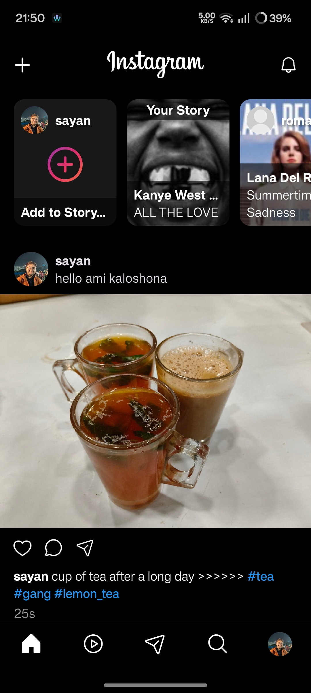
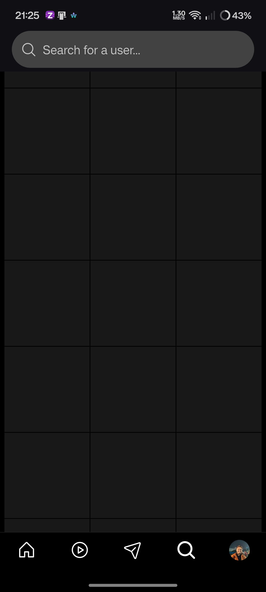
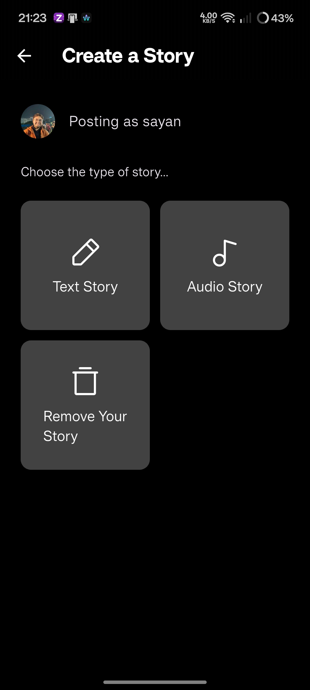
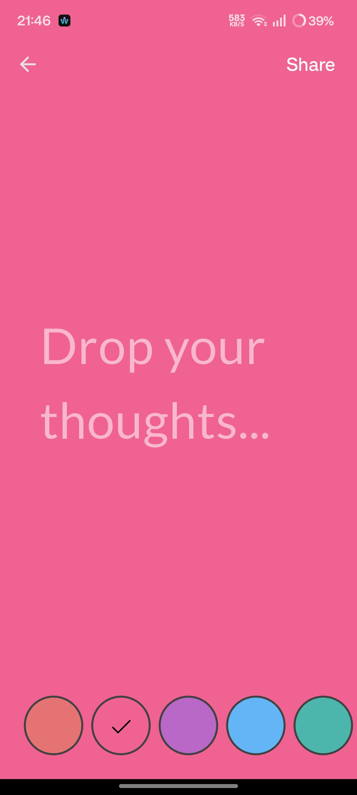
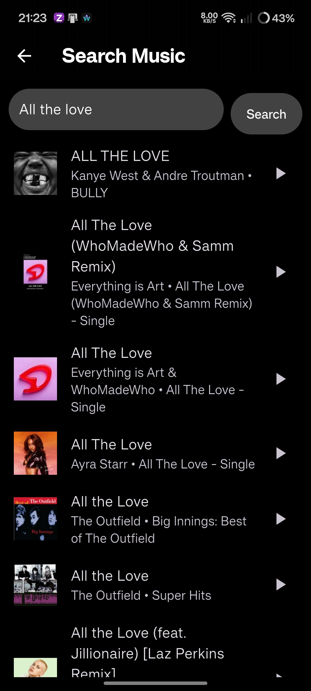
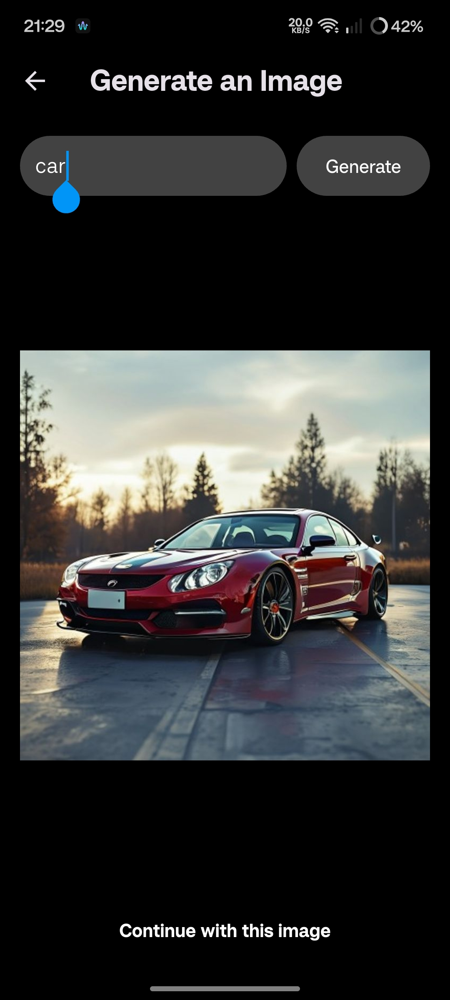
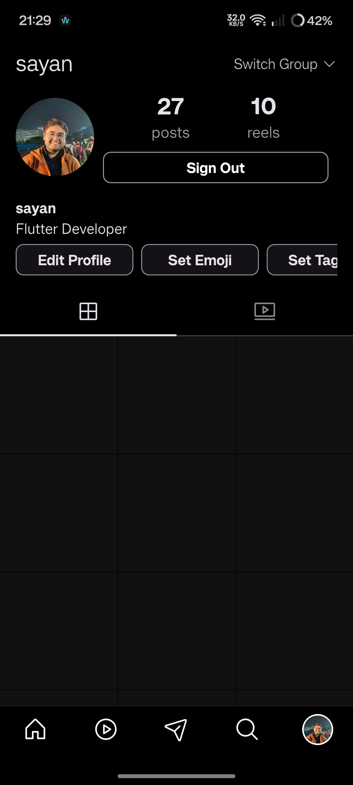
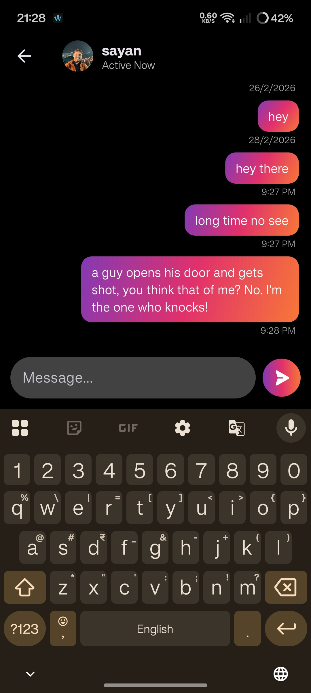

# Insta

This project is a clone (with some added goodness) of Instagram built using Flutter and Firebase. It replicates the core features of Instagram, such as user authentication, image sharing, video sharing, adding text/audio stories, adding comments, liking posts, sharing posts, sending messages and also notifications for activities.

## Features

- **User Authentication:** Users can sign up, log in, and manage their profiles using Firebase Authentication.
- **Image Upload:** Users can upload and share photos with others, using Cloudinary for image hosting.
- **Reel Upload:** Users can upload and share short form videos with others, using Telegram for video hosting.
- **Likes & Comments:** Users can like posts and leave comments, with real-time updates.
- **Posting Stories:** Users can post an audio story/text story based on their mood.
- **Notifications:** Users get notifications for likes/comments on their posts/reels also for new messages in their dm.
- **Shares:** Users can share images or videos.
- **Chat:** Users can open a chat window and text with each other.
- **Searching Users:** Users can Search for other users, and see all their posts directly.
- **Edit Profile:** Users can edit their profile anytime they want.
- **Generative AI:** Users can generate images from prompt, and directly post it.

## Getting Started

### Prerequisites

- **Flutter SDK:** Install the latest version of Flutter from the [official website](https://flutter.dev).
- **Firebase Account:** Set up a Firebase project and enable Authentication, Firestore, and Storage.

### Environment Configuration

1. **Environment Variables:**
   - Create a `.env` file in the root directory of your project. Include the necessary environment variables (needed for Generative AI features)
   - Example `.env` file:
     ```dotenv
     BASE_URL=your_base_url
     ```

2. **Firebase Configuration Files:**
   - **Android:**
     - Download the `google-services.json` file from your Firebase project settings and place it in the `android/app` directory.
   - **iOS:**
     - Download the `GoogleService-Info.plist` file from your Firebase project settings and place it in the `ios/Runner` directory.
     - If applicable, download the `firebase_app_id_file.json` file for iOS and place it in the `ios/` directory.
   - **Dart Configuration:**
     - Generate the `firebase_options.dart` file using the `flutterfire configure` command or by following the official [Firebase Flutter documentation](https://firebase.flutter.dev/docs/overview).

3. **Run the App:**
   ```bash
   flutter run
   ```

## Folder Structure

Here is an overview of the folder structure:

```plaintext
instagram_flutter/
├── android/                    # Android platform-specific code
├── ios/                        # iOS platform-specific code
├── lib/                        # Dart code for the Flutter app
│   ├── models/                 # Data models
|   ├── providers/              # Providers for state management
|   ├── resources/              # Contains authentication and storage methods for firebase
|   ├── responsive/             # Files to render responsive UI
│   ├── screens/                # App screens (e.g., Feed, Profile)
│   ├── utils/                  # Contains global variables
│   ├── widgets/                # Reusable widgets
│   └── main.dart               # Entry point of the app
├── assets/                     # Project assets (images, fonts, etc.)
│   └── images/                 # Image assets
├── test/                       # Unit and widget tests
├── flutter_native_splash.yaml  # Flutter dependency for custom splash_screen
├── pubspec.yaml                # Flutter dependencies and project metadata
├── .gitignore                  # Git ignore file
└── README.md                   # Project documentation
```

## .gitignore

Make sure to include the following files and directories in your `.gitignore`:

```bash
.env
android/app/google-services.json
ios/Runner/GoogleService-Info.plist
lib/firebase_options.dart
```

## Screenshots

Here are some screenshots of the app:

### Home Feed & Search Screen
<div style="display: flex; gap: 10px;">
    
    
</div>

### Stories Section
<div style="display: flex; gap: 10px;">
    
    
    
    
</div>

### Image Generation
<div style="display: flex; gap: 10px;">
   
</div>

### Profile Section
<div style="display: flex; gap: 10px;">
   
</div>

### Chat Section
<div style="display: flex; gap: 10px;">
   
</div>

## Contributing

Contributions are welcome! Please follow these steps:

1. **Fork the repository**: Click the "Fork" button on the top right of the repository page to create a copy of the repository under your GitHub account.
2. **Clone your fork**: Clone the forked repository to your local machine.
   ```bash
   git clone https://github.com/your-username/instagram_flutter.git
    ```
3. **Create a new branch**: Create a new branch for your feature or bug fix.
    ```bash
    git checkout -b feature/YourFeature
    ```
4. **Make changes**: Implement your changes or improvements.
5. **Commit your changes**: Commit your changes with a descriptive commit message.
    ```bash
    git commit -m 'Add some feature'
    ```
6. **Push to the branch**: Push your changes to your forked repository.
    ```bash
    git push origin feature/YourFeature
    ```
7. ***Open a pull request**: Go to the original repository and open a pull request from your branch. Provide a clear description of your changes.

## Acknowledgments

- **Flutter:** For providing a powerful framework for building cross-platform apps.
- **Firebase:** For backend services like authentication, Firestore, and storage.
- **The Flutter Community:** For the open-source libraries and resources that help in building and improving the app.
- **IconFinder & Unsplash:** For the free icons and images used in the app design.
- **Stack Overflow:** For the community support and solutions to common issues faced during development.
- **Apple Music API:** For the free api for audio stories.
- **[Pollinations AI](https://pollinations.ai/)**: This project utilizes code and concepts from [Pollinations AI](https://pollinations.ai/). Special thanks to the contributors for their valuable work.
